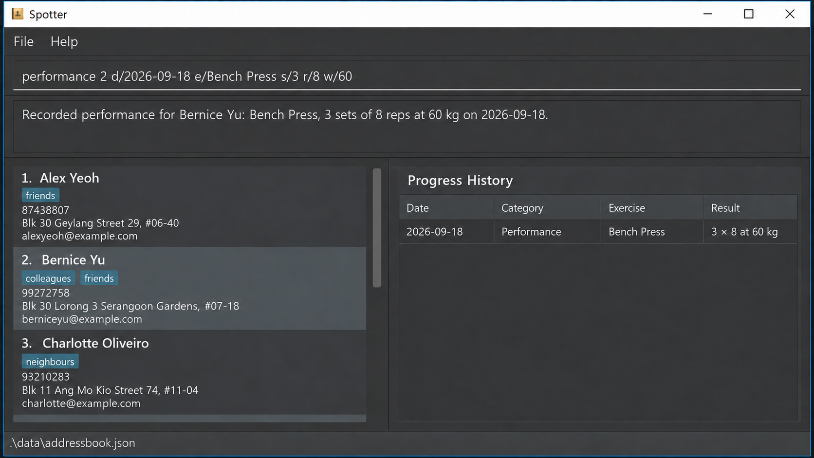

# Spotter

Spotter is a desktop client-management application for freelance personal trainers who independently manage their own clients. It keeps each client's contact details, training sessions, and progress records in one place, helping trainers find information quickly, prepare for sessions, and track each client's development.

## Documentation

* [Product website](https://ay2627s1-cs2103t-f14a-2.github.io/tp/)
* [User Guide](https://ay2627s1-cs2103t-f14a-2.github.io/tp/UserGuide.html)
* [Developer Guide](https://ay2627s1-cs2103t-f14a-2.github.io/tp/DeveloperGuide.html)
* [About Us](https://ay2627s1-cs2103t-f14a-2.github.io/tp/AboutUs.html)

## Acknowledgements

This project is based on the AddressBook-Level3 project created by the [SE-EDU initiative](https://se-education.org).
