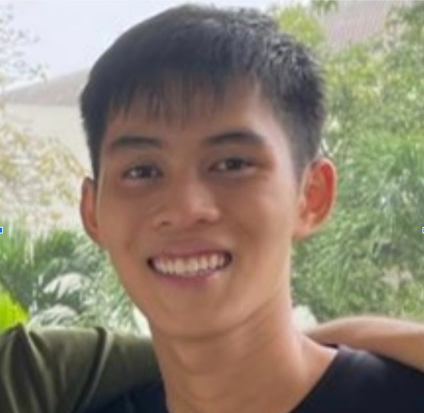
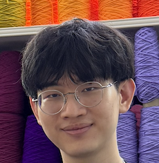
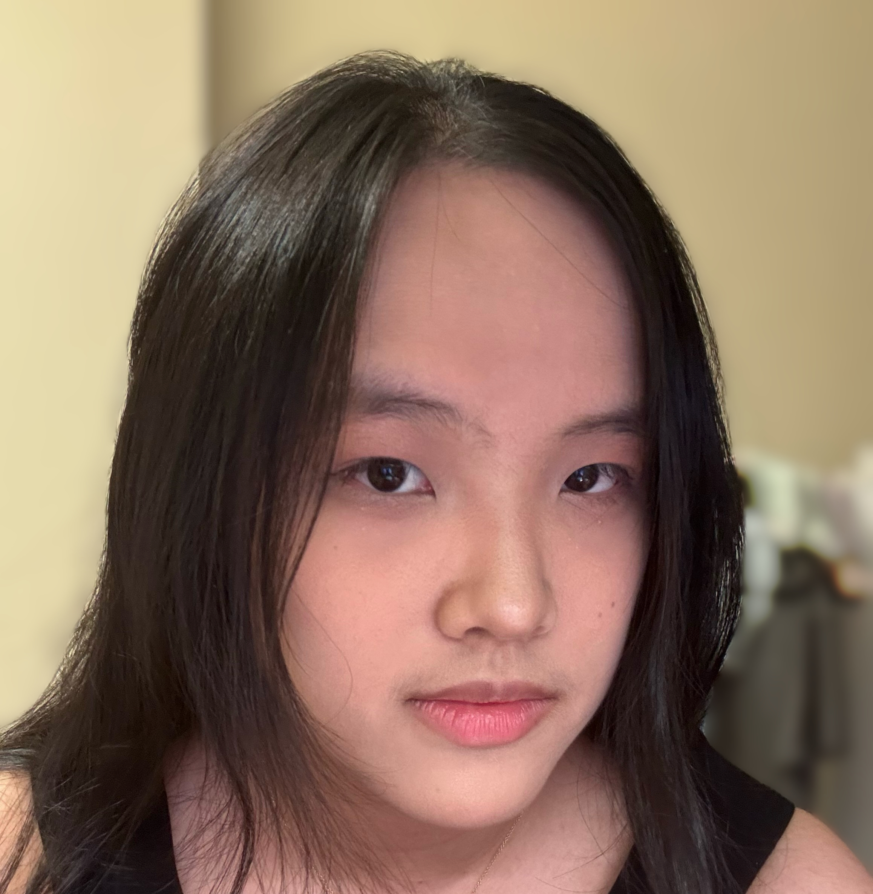

# About Us

We are a team based in the [School of Computing, National University of Singapore](http://www.comp.nus.edu.sg).

You can reach us at the email `seer[at]comp.nus.edu.sg`

## Project team

### Gabriel Wan

[[github](https://github.com/gabriel-wan)]

* Role: DevOps and Integration
* Responsibilities: Maintains CI and the project website, coordinates safe PR integration, and helps keep the main branch buildable.

### Vincent Ong

[[github](https://github.com/v1-nce)]

* Role: Testing and Code Quality
* Responsibilities: In charge of the Logic component; oversees test coverage and reviews PRs for coding standards.

### Luke Chin

[[github](https://github.com/EkulNich)] [[portfolio](team/johndoe.md)]

* Role: Developer
* Responsibilities: Target-user profile, value proposition, and user stories

### Dai Yangjie

[[github](https://github.com/Dai-yangjie)]

* Role: Developer
* Responsibilities: Implement functions, improve the code framework

### James Doe

[[github](http://github.com/johndoe)]
[[portfolio](team/johndoe.md)]

* Role: Developer
* Responsibilities: UI
